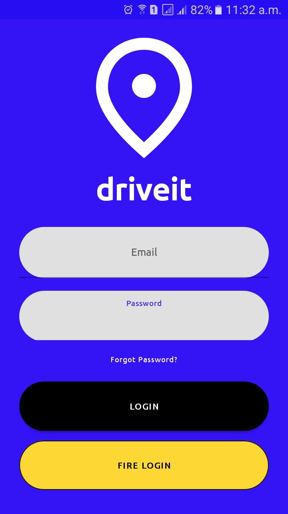
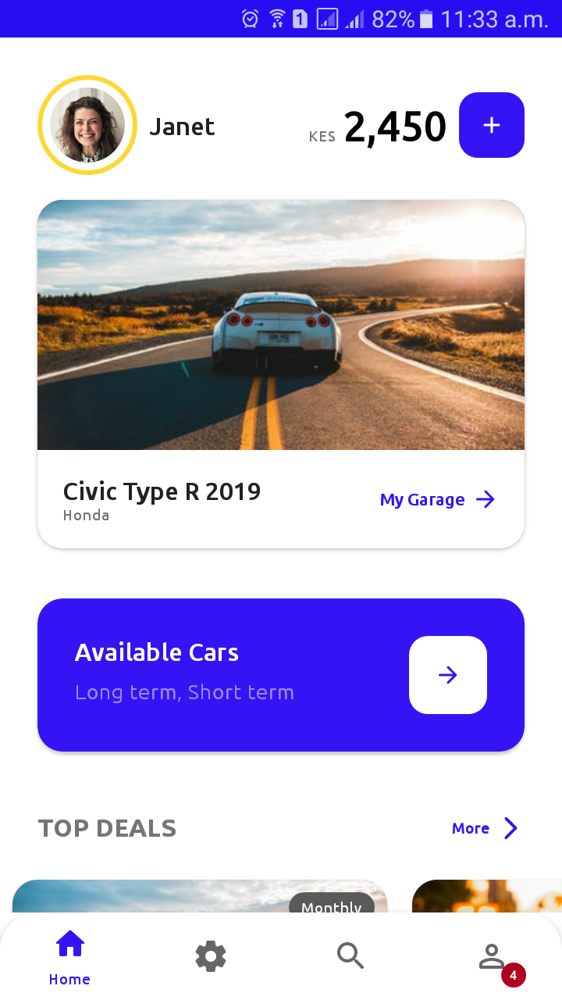
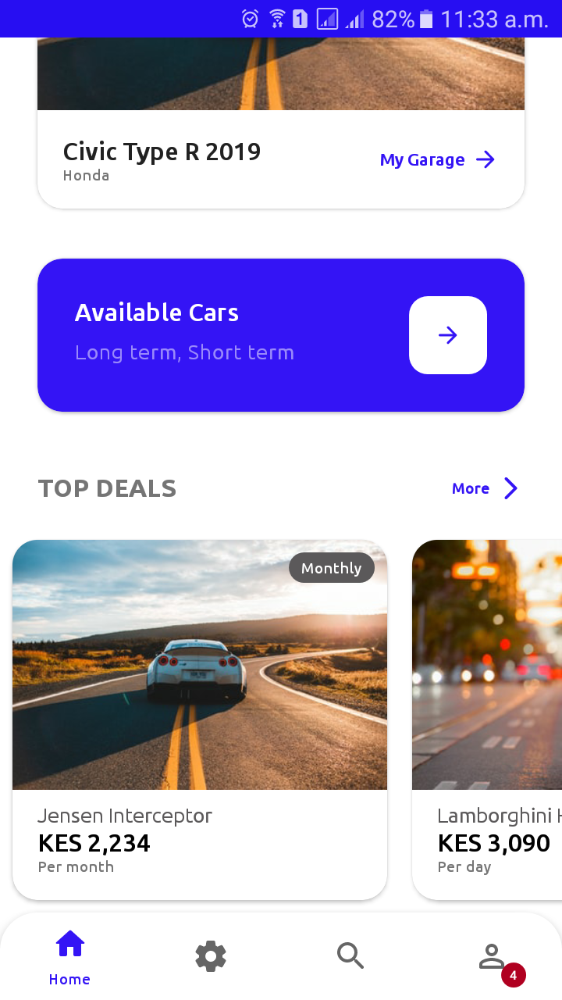
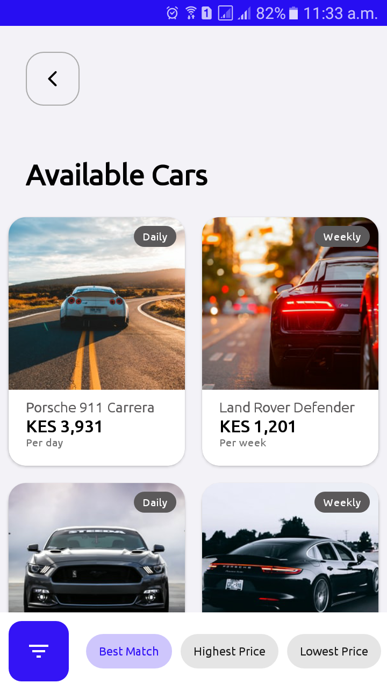

# driveit
A sample app integrating ReqRes and Firebase authentication. A sample of the design can be found [here](https://dribbble.com/shots/9324676-Car-Rental-app).

## Screenshots

  
  
  
  

